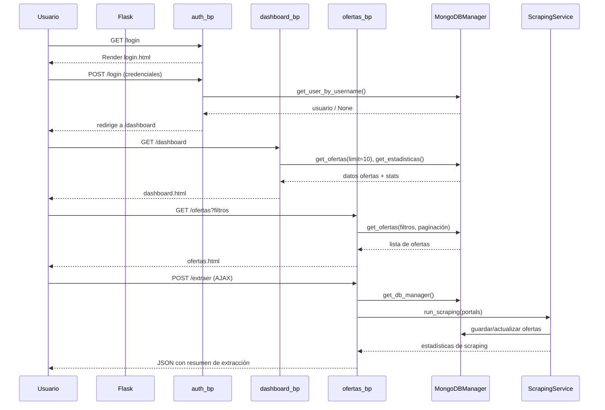

## Sistema de Ofertas Laborales – Tacna

Aplicación web en **Flask + MongoDB** para consultar, filtrar y analizar **ofertas laborales de Tacna**, con módulo de **scraping** a portales de empleo y panel de control con estadísticas básicas.

---

## 1. Objetivo del proyecto

- **Centralizar** ofertas laborales de diferentes portales enfocadas en Tacna.
- Permitir **búsqueda y filtrado** por empresa, nivel académico, modalidad, etc.
- Proveer un **dashboard** con estadísticas agregadas (por fuente, nivel, modalidad, empresas).
- Ofrecer un **servicio de scraping replicable**, configurable vía entorno (`.env` y `Config`).

---

## 2. Tecnologías principales

| Capa            | Tecnología / Librería              | Descripción breve                                      |
|-----------------|------------------------------------|--------------------------------------------------------|
| Backend Web     | **Flask**                          | Framework web ligero en Python                        |
| Base de datos   | **MongoDB** + `pymongo`            | Almacenamiento NoSQL de ofertas y usuarios            |
| Scraping        | `requests`, `beautifulsoup4`       | Obtención y parseo de páginas de empleo               |
| Configuración   | `python-dotenv` + clase `Config`   | Carga de variables de entorno y parámetros del sistema|
| Frontend        | HTML5, CSS (`static/css`), JS      | Plantillas Jinja2 con recursos estáticos              |

---

## 3. Arquitectura general

La arquitectura es una combinación de **MVC ligero** y **arquitectura por capas**:

- **Presentación (Vistas)**: plantillas en `app/templates/*.html`.
- **Controladores (Control)**: blueprints en `app/controllers/` (`auth.py`, `dashboard.py`, `ofertas.py`).
- **Servicios (Modelo/Lógica de negocio)**:
  - `app/services/database_service.py` – acceso a MongoDB (CRUD, estadísticas).
  - `app/services/scraping_service.py` – scraping de portales configurados.
- **Utilidades**: `app/utils/helpers.py`, `validators.py`.
- **Configuración**: `config/settings.py` con la clase `Config`.

Además, existe un `app.py` con una **versión simplificada/monolítica** de la aplicación (rutas definidas directamente sobre `app`), útil como “modo compacto” o legado.

### 3.1. Diagrama de módulos (vista lógica)

```mermaid
graph TD
    A[Usuario / Navegador] --> B[Flask App]

    subgraph Controladores
      C1[auth.py\n(login/logout)]
      C2[dashboard.py\n(dashboard/estadísticas)]
      C3[ofertas.py\n(listar/ver/extraer)]
    end

    B --> C1
    B --> C2
    B --> C3

    subgraph Servicios
      S1[database_service.py\nMongoDBManager]
      S2[scraping_service.py\nScrapingService]
    end

    C1 --> S1
    C2 --> S1
    C3 --> S1
    C3 --> S2

    S1 --> D[(MongoDB)]

    C1 --> T1[login.html]
    C2 --> T2[dashboard.html]
    C2 --> T3[estadisticas.html]
    C3 --> T4[ofertas.html]
    C3 --> T5[ver_oferta.html]
```

### 3.2. Flujo principal de uso



---

## 4. Estructura de carpetas

```text
ofertas_laborales/
  app.py                # Versión simplificada 'todo en uno'
  run.py                # Punto de entrada que ejecuta app.py
  scraping.log          # Log de scraping
  requirements.txt      # Dependencias del proyecto

  config/
    settings.py         # Clase Config (Flask, Mongo, scraping, etc.)

  app/
    __init__.py
    controllers/
      auth.py           # Login, logout, login_required
      dashboard.py      # Dashboard y estadísticas
      ofertas.py        # Listar/ver ofertas, API y extracción
    services/
      database_service.py   # MongoDBManager (acceso DB + stats)
      scraping_service.py   # Lógica de scraping a portales
    templates/
      base.html
      login.html
      dashboard.html
      estadisticas.html
      ofertas.html
      ver_oferta.html
    static/
      css/style.css
      js/main.js
    utils/
      helpers.py
      validators.py

  data/                 # Carpeta reservada para datos adicionales
  scripts/
    scraping_cli.py     # Script CLI para lanzar scraping
```

---

## 5. Metodología de desarrollo

La forma en que está organizado el código refleja una **metodología de desarrollo incremental e iterativa**:

- Se partió de una **implementación simplificada/monolítica** (`app.py`) para tener rápidamente una versión funcional.
- Posteriormente se **refactorizó y modularizó**:
  - Separando **controladores** en `app/controllers` usando **Blueprints de Flask**.
  - Extrayendo la lógica de **acceso a datos** a `MongoDBManager` (`database_service.py`).
  - Encapsulando la lógica de **scraping** en `ScrapingService` (`scraping_service.py`).
  - Centralizando la configuración en la clase `Config` (`config/settings.py`).

Este enfoque es coherente con:

- **Desarrollo incremental e iterativo**: se agregan funcionalidades y se mejora la arquitectura en ciclos cortos, sin reescribir todo desde cero.
- **Buenas prácticas de arquitectura por capas**:
  - Capa de presentación (templates).
  - Capa de control (blueprints/controladores).
  - Capa de servicios / negocio (database + scraping).
  - Capa de configuración/utilidades.

### 5.1. Resumen de responsabilidades por capa

| Capa               | Componentes principales                          | Responsabilidad clave                          |
|--------------------|--------------------------------------------------|-----------------------------------------------|
| Presentación       | `templates/*.html`, `static/css`, `static/js`    | Interfaz de usuario y renderizado HTML        |
| Controladores      | `app/controllers/*.py`                           | Rutas, validaciones básicas, orquestación     |
| Servicios          | `database_service.py`, `scraping_service.py`     | Lógica de negocio y acceso a datos            |
| Configuración      | `config/settings.py` (`Config`)                  | Parámetros de entorno, URLs, límites, logging |
| Utilidades         | `app/utils/*.py`                                 | Funciones auxiliares y validación             |

---

## 6. Endpoints principales

| Método | Ruta                | Descripción                                      | Autenticación |
|--------|---------------------|--------------------------------------------------|---------------|
| GET    | `/login`            | Muestra formulario de inicio de sesión          | No            |
| POST   | `/login`            | Procesa login, gestiona modo offline            | No            |
| GET    | `/logout`           | Cierra sesión                                   | Sí            |
| GET    | `/dashboard`        | Dashboard con últimas ofertas y fuentes         | Sí            |
| GET    | `/estadisticas`     | Estadísticas agregadas por nivel, modalidad, etc| Sí            |
| GET    | `/ofertas`          | Listado de ofertas con filtros y paginación     | Sí            |
| GET    | `/ofertas/<id>`     | Detalle de una oferta                           | Sí            |
| GET    | `/api/ofertas`      | API JSON (para AJAX) de ofertas filtradas       | Sí            |
| POST   | `/extraer`          | Lanza el scraping de nuevos datos               | Sí (admin)    |

> Nota: En la versión modular, algunas rutas se exponen a través de los blueprints `auth_bp`, `dashboard_bp` y `ofertas_bp`.

---

## 7. Configuración y ejecución

### 7.1. Requisitos

- **Python** 3.10+ (recomendado).
- **MongoDB** instalado localmente o instancia en la nube (MongoDB Atlas).

### 7.2. Instalación de dependencias

```bash
pip install -r requirements.txt
```

### 7.3. Variables de entorno (.env)

Ejemplo mínimo de `.env`:

```bash
SECRET_KEY=alguna_clave_segura
FLASK_DEBUG=True
MONGODB_URI=mongodb://localhost:27017/
LOG_LEVEL=INFO
```

### 7.4. Ejecutar la aplicación

```bash
python run.py
```

Por defecto la app correrá en `http://localhost:5000`.

---

## 8. Scraping y fuentes de datos

Las URLs de los portales están definidas en `Config.PORTALS` (`config/settings.py`), por ejemplo:

- `computrabajo`
- `bumeran`
- `indeed`
- `trabajos_pe`

El servicio `ScrapingService`:

- Recupera páginas HTML desde los portales.
- Extrae las ofertas relevantes para Tacna.
- Normaliza los datos (título, empresa, nivel, modalidad, fuente, etc.).
- Inserta o actualiza documentos en MongoDB a través de `MongoDBManager`.

---

## 9. Manejo de errores y modo offline

- Si MongoDB no está disponible:
  - El sistema puede funcionar en un **modo sin conexión** limitado.
  - En login se permite el usuario de emergencia `admin/admin123`.
  - Se muestran mensajes claros sobre la necesidad de configurar MongoDB.
- Hay **manejadores globales de errores** en `app.py` que retornan respuestas JSON estructuradas para errores 500 y excepciones no manejadas.

---

## 10. Posibles mejoras futuras

- Registro y gestión de múltiples usuarios con roles (ej. admin, solo lectura).
- Panel para configurar dinámicamente portales y parámetros de scraping.
- Alertas por correo o notificaciones cuando aparezcan nuevas ofertas que cumplan ciertos criterios.
- Tests automatizados de scraping y de controladores (Pytest).

---

## 11. Créditos

Proyecto desarrollado siguiendo un enfoque **incremental e iterativo**, priorizando:

- Tener primero una versión funcional sencilla.
- Refactorizar luego hacia una arquitectura más limpia, modular y mantenible.


